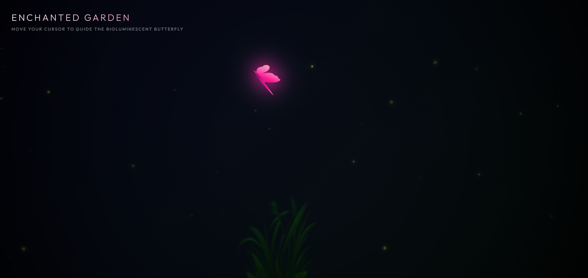

# 🦋 Bioluminescent Butterfly — Enchanted Garden

An immersive, interactive web experience where a glowing bioluminescent butterfly follows your cursor through a dark enchanted garden, leaving a trail of sparkles in its wake.



> 🌐 **Live Demo:** [butterfly-bloom.netlify.app](https://butterfly-bloom.netlify.app/)

---

## ✨ Features

- **🖱️ Cursor-Guided Butterfly** — The butterfly smoothly follows your mouse with physics-based easing and speed-capping for natural, organic motion.
- **🌈 Glowing Bioluminescent Wings** — SVG wings rendered with animated pink-to-purple gradients and a pulsing `drop-shadow` glow effect.
- **💫 Sparkle Trail** — As the butterfly moves, it leaves behind randomly drifting sparkle particles that fade out gracefully.
- **🔆 3D Wing Flapping** — Wings realistically flap using CSS `rotateY` transforms synchronized to movement direction, giving a true sense of depth.
- **🌿 Animated Garden Scene** — Layered foreground and background grass SVGs create a parallax-like depth effect with a gentle sway animation.
- **🪲 Fireflies** — 28 floating, pulsing firefly particles drift through the scene, adding life and atmosphere.
- **🌑 Vignette & Dark Atmosphere** — A deep navy-to-dark-green radial gradient background with a vignette overlay creates a mysterious nocturnal mood.
- **📱 Mobile Awareness** — Displays a friendly "Best Experienced on Desktop" overlay on smaller screens, with a Lottie animated emoji.

---

## 🛠️ Tech Stack

| Technology | Usage |
|---|---|
| **HTML5 / SVG** | Butterfly shape, grass scene, DOM structure |
| **Vanilla CSS3** | Animations, gradients, 3D transforms, responsive design |
| **Vanilla JavaScript** | Mouse/touch tracking, animation loop, particle system |
| **[Lottie Web](https://airbnb.io/lottie/)** | Animated sad-face emoji on mobile warning screen |
| **[Google Fonts — Outfit](https://fonts.google.com/specimen/Outfit)** | Clean, modern UI typography |

No frameworks. No build tools. Zero dependencies beyond the two CDN scripts above.

---

## 🎨 Design Details

### Color Palette

| Role | Value |
|---|---|
| Background (top) | `hsl(235, 60%, 7%)` — deep navy |
| Background (bottom) | `hsl(155, 45%, 4%)` — dark forest green |
| Wing gradient | `#ff69b4` → `#ff1493` → `#c71585` → `#8b008b` |
| Glow (pink) | `rgba(255, 20, 147, 0.6)` |
| Sparkles | `hsl(310–350, 100%, 75%)` randomized |
| Fireflies | `hsl(68, 100%, 75%)` — warm yellow-green |
| Grass (foreground) | `hsl(90, 85%, 45%)` → `hsl(120, 70%, 15%)` |

### Animations

- **`glowPulse`** — Butterfly glow breathes every 3 seconds
- **`butterflyFloat`** — Subtle vertical float on a 4-second cycle
- **`grassMove`** — Grass sways horizontally every 9 seconds
- **`floatDrift`** — Fireflies drift in random 3-point paths (15–30s cycles)
- **`pulseFade`** — Firefly opacity pulses independently (3–7s cycles)
- **`sparkleFade`** — Sparkles scatter and vanish over 1.2 seconds
- **`fadeIn`** — Page fades in on load with a subtle scale

---

## 🗂️ Project Structure

```
Bioluminescent Butterfly NETLIFY/
├── index.html        # Main page — all HTML, SVG, and JavaScript
├── butterfly.css     # All styles, animations, and responsive rules
└── README.md         # This file
```

---

## 🚀 Getting Started

No install required. Just open `index.html` in any modern browser.

```bash
# Clone or download the repository, then simply open:
index.html
```

Or serve it locally with any static file server:

```bash
# Using Python
python -m http.server 8080

# Using Node.js (npx)
npx serve .
```

Then visit `http://localhost:8080` in your browser.

> **Best experienced on desktop** with a mouse. The butterfly is guided by cursor position and the scene is optimized for landscape viewports.

---

## 🌐 Deployment (Netlify)

This project is configured for zero-configuration deployment on [Netlify](https://netlify.com).

**Manual Deploy:**
1. Drag and drop the project folder onto the Netlify dashboard.

**Git-Connected Deploy:**
1. Push the repository to GitHub/GitLab.
2. Connect the repo in the Netlify dashboard.
3. Set **Publish directory** to `/` (root).
4. Deploy!

---

## 🧠 How It Works

### Butterfly Movement
The butterfly uses a **request-animation-frame loop** with exponential easing (`factor = 0.22`) toward the cursor target. A **max-speed cap** (`5px/frame`) prevents teleporting and keeps motion smooth. The movement angle drives the rotation transform, and the speed drives a `rotateX` tilt for a 3D banking effect.

### Wing Flapping
Wing flap angle is derived from `Math.sin(Date.now() * 0.02)` — a time-based sine wave — applied as opposing `rotateY` values to the left and right wing SVGs. Direction-awareness flips the values when the butterfly faces left.

### Particle System
Every few frames (rate-limited by distance), a `sparkle-trail` div is injected at the butterfly's position with random CSS custom properties (`--dx`, `--dy`) for drift direction, and removed after 1.2 seconds via `setTimeout`.

### Fireflies
Generated at startup, each firefly div receives unique randomized animation durations, delays, and drift vectors via CSS custom properties — all driven purely by CSS keyframe animations for maximum performance.

---

## 📄 License

This project is open source. Feel free to fork, remix, and make it your own. 🦋
